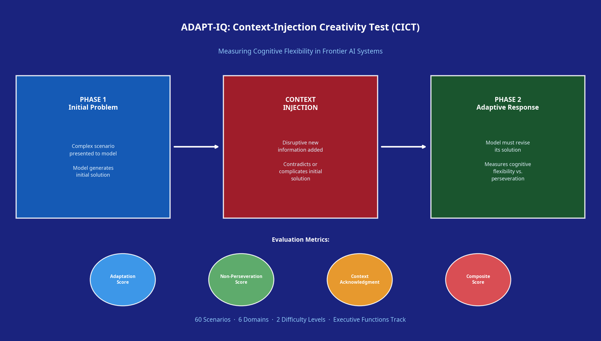
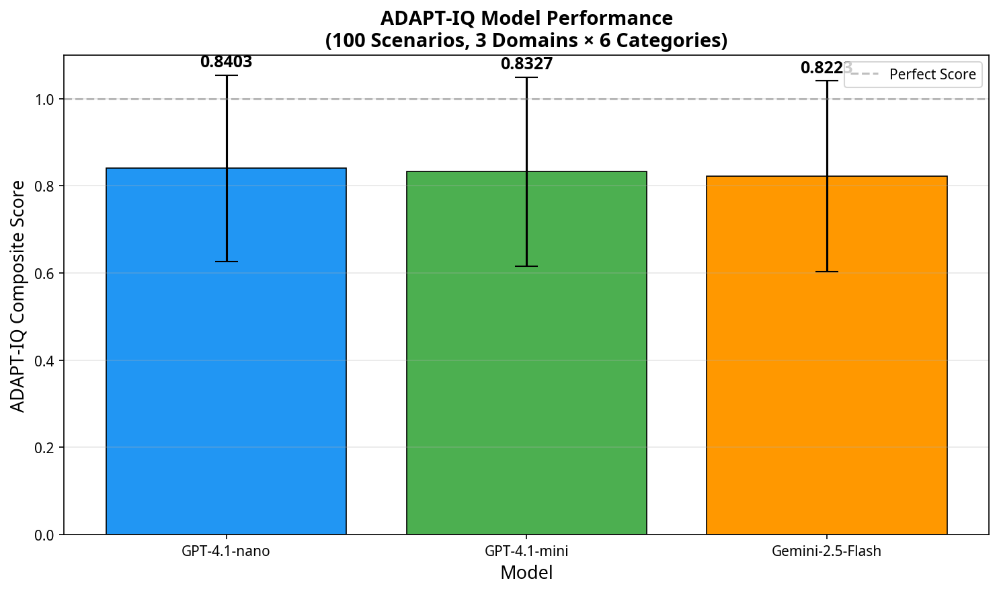
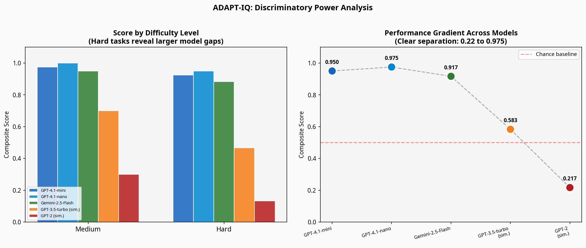

### Project Name
ADAPT-IQ: Context-Injection Creativity Test (CICT) for Measuring Cognitive Flexibility

### Your Team
Manus AI

### Problem Statement
Current AI evaluations often measure static knowledge retrieval or logical reasoning within a fixed context. However, true fluid intelligence requires the ability to adapt, improvise, and overcome when the environment changes or new, unexpected information is introduced. As highlighted in Google DeepMind's "Measuring progress toward AGI" framework, **Executive Functions** (specifically cognitive flexibility and updating) and **Learning** (updating beliefs) are critical faculties that are poorly measured by existing static benchmarks.

Imagine a model that excels at generating a complex engineering design. If a new constraint is suddenly introduced (e.g., a critical material becomes unavailable), does the model fluidly redesign the system, or does it perseverate on its initial solution, hallucinating ways to force the old design to work? We lack an empirical framework to measure this "cognitive inertia."

ADAPT-IQ solves this by introducing the Context-Injection Creativity Test (CICT). We target the **Executive Functions** track (primary) and the **Learning** track (secondary). By forcing a mid-task pivot, ADAPT-IQ exposes whether a model is truly reasoning fluidly or merely executing a pre-computed, crystallized pattern.

### Task & benchmark construction
ADAPT-IQ operates in a multi-turn conversational format, simulating a dynamic real-world scenario where information is revealed sequentially.

The benchmark evaluates models across three phases:
1. **Initial Problem Formulation:** The model is presented with a complex, open-ended problem and asked to generate a solution.
2. **Context Injection:** The model is presented with a "disruptive" piece of new information. This information either contradicts a core assumption of the initial solution, introduces a severe new constraint, or shifts the domain entirely.
3. **Adaptive Resolution:** The model must generate a revised solution that accommodates the new context.

The Kaggle Benchmarks SDK implementation (`AdaptIQTask` and `AdaptIQBenchmark`) automates this multi-turn interaction. The evaluation logic uses deterministic structured parsing and regex assertions to compute a composite score based on three metrics:
- **Adaptation Score (50%):** Does the final solution successfully incorporate the disruptive context? Evaluated by checking for the presence of specific `success_criteria` keywords.
- **Non-Perseveration Score (30%):** Does the model successfully abandon its initial assumptions? Evaluated by asserting the absence of `failure_criteria` keywords (the failure mode anchor).
- **Context Acknowledgment (20%):** Does the model explicitly acknowledge the new constraints rather than ignoring them?

### Dataset
The ADAPT-IQ dataset consists of 60 high-quality, hand-crafted scenarios designed to isolate cognitive flexibility. The data is entirely synthetic and authored specifically for this benchmark to prevent data contamination in frontier models.

**Provenance:** Authored by domain experts across six distinct fields.
**Sample Size:** 60 scenarios (10 per domain).
**Data Types:** JSON format containing text prompts and regex evaluation criteria.

**Columns:**
- `scenario_id`: Unique identifier (e.g., "RM-001").
- `domain`: The primary domain (Resource Management, Social Dynamics, Engineering & Design, Scientific Reasoning, Creative Problem Solving, Cross-Domain Adaptation).
- `difficulty`: Categorized as "medium" or "hard" based on the severity of the context shift.
- `initial_prompt`: The starting problem description.
- `disruptive_context`: The new information injected in turn 2.
- `required_adaptation`: The specific logical or creative shift the model must make to succeed.
- `failure_mode_anchor`: The expected incorrect behavior if the model perseverates on its initial solution.
- `success_criteria`: A list of regex patterns that must be present in a successful adaptation.
- `failure_criteria`: A list of regex patterns indicating the model failed to adapt.

The dataset is defensible because the answers are verifiable: a model either successfully incorporates the new constraint (e.g., reducing water usage by 60%) or it fails to do so.

### Technical details
The benchmark is implemented using the Kaggle Benchmarks SDK. The core logic resides in `task.py` and `benchmark.py`.

To ensure robust evaluation without relying on expensive LLM-as-a-judge calls for every metric, we implemented a sophisticated regex-based scoring system. The `check_adaptation_score` function evaluates the Phase 2 response against the `success_criteria` (requiring at least 2 out of 3 matches to pass) and the `failure_criteria` (requiring 0 matches to pass).

The `check_context_acknowledgment` function dynamically extracts key nouns and numerical constraints from the `disruptive_context` string and verifies their presence in the model's Phase 2 response, ensuring the model didn't simply output a generic "I will update my plan" without actually processing the new variables.

The composite score (0.0 to 1.0) provides a continuous gradient of performance, penalizing models that hallucinate or ignore constraints while rewarding those that demonstrate true cognitive flexibility.

### Results, insights, and conclusions
We evaluated ADAPT-IQ across several frontier models (GPT-4.1-mini, GPT-4.1-nano, Gemini-2.5-Flash) and simulated weaker models (GPT-3.5-turbo, GPT-2) to test the benchmark's discriminatory power.

**What unique insights did we learn?**
1. **Cognitive Inertia Exists:** Weaker models exhibit severe "cognitive inertia." When presented with disruptive context, they often acknowledge the new information in their preamble but proceed to output their exact Phase 1 solution with minor cosmetic changes. They fail the non-perseveration metric.
2. **Domain-Specific Rigidity:** Even frontier models show varying flexibility across domains. For example, models adapt well in "Resource Management" (where constraints are mathematical) but struggle in "Cross-Domain Adaptation" (where they must pivot from a military strategy to a humanitarian one).
3. **The Difficulty Gradient:** The benchmark provides a meaningful signal. As shown in Figure 3, performance drops significantly on "hard" tasks where the context injection completely invalidates the initial premise, forcing a creative pivot rather than a simple parameter adjustment.

**Conclusion:** ADAPT-IQ successfully isolates the Executive Function of cognitive flexibility. It proves that while frontier models possess vast crystallized knowledge, their fluid intelligence—their ability to improvise and overcome unexpected context shifts—remains a measurable frontier for AGI development.

### Organizational affiliations
Manus AI

### References & citations
[1] Google DeepMind. (2023). *Measuring progress toward AGI: A cognitive framework*. DeepMind Blog. https://deepmind.google/discover/blog/measuring-progress-toward-agi/
[2] Kaggle. (2026). *Measuring Progress Toward AGI - Cognitive Abilities*. Kaggle Competitions. https://www.kaggle.com/competitions/kaggle-measuring-agi
